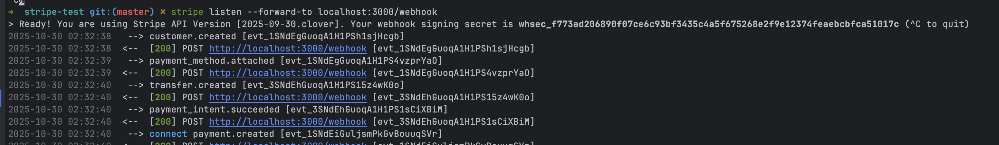

## Stripe Test

## 젤팔라 시스템에 필요한 sdk 
아래 제공되는 코드들은 모두 테스트 때 사용한 코드이므로 추후 필요에 따라
추가 프로퍼티가 추가되거나 삭제될 수 있음!

sdk docs: https://docs.stripe.com/development

### 드라이버 계정 생성
```javascript
await stripe.accounts.create({
    type: "express",
    capabilities: {
        card_payments: {requested: true},
        transfers: {requested: true},
    },
    business_type: "individual",
    metadata: {role: "driver"},
});
```

### 트럭 기사 계정 생성
```javascript
await stripe.accounts.create({
    type: "express",
    capabilities: {
        card_payments: {requested: true},
        transfers: {requested: true},
    },
    business_type: "company",
    metadata: {role: "truck_company"},
});
```

### 계정 계좌 연결을 위한 링크 생성
- Stripe 정책상 API 또는 sdk로 계좌 연결 및 인증이 불가능함으로 직접 해야함
```javascript
await stripe.accountLinks.create({
    account: driver.id,
    refresh_url: "https://jelpala.com/onboarding/retry",
    return_url: "https://jelpala.com/onboarding/complete",
    type: "account_onboarding",
});
```

## 비회원 카드 등록을 위한 비회원 stripe 등록
- customer_id 가 있을 경우는 해당 customer_id 사용 없을 경우 비회원 임의 생성
```javascript
let customer_id = req.body?.customer_id || null;
if (!customer_id) {
    const customer = await stripe.customers.create({
        description: "Guest Checkout - No Login",
    });
    customer_id = customer.id
}

const setupIntent = await stripe.setupIntents.create({
    payment_method_types: ['card'],
    customer: customer_id,
});

res.json({
    clientSecret: setupIntent.client_secret,
    customer_id,
});
```

## 비회원 카드 조회
```javascript
const { customerId } = req.body;
const methods = await stripe.paymentMethods.list({
    customer: customerId,
    type: "card",
});
res.json(methods.data);
```

## 추후 배송 완료 때 결제 처리
- 참고: stripe 결제 api 는 모두 cent 가 1이기 때문에 (소수점이없음) 
- ex) 100달러 -> 10000 임
```javascript
const {
    amount = 10000,
    currency = "cad",
    payment_method_id,
    customer_id,
    driver_account_id,
    truck_account_id
} = req.body;

if (!payment_method_id) {
    return res.status(400).json({error: "Missing payment_method_id IDs"});
}

if (!customer_id) {
    return res.status(400).json({error: "Missing customer account IDs"});
}

if (!driver_account_id || !truck_account_id) {
    return res.status(400).json({error: "Missing driver/truck account IDs"});
}

const customer = await stripe.customers.retrieve(customer_id);
console.log(customer.email); // ⚠️ 없으면 안 보냄

try {

    await stripe.paymentMethods.attach(payment_method_id, {customer: customer_id});

    const platformFee = Math.round(amount * 0.3); // 젤팔라 15%

    console.log(`>>> ✅ 결제 내역`)
    console.log(`amount:`, amount)
    console.log(`PlatformFee:`, platformFee)

    // 1️⃣ 기존 customer로 invoice 생성
    const invoice = await stripe.invoices.create({
        customer: customer_id,
        auto_advance: false, // 결제는 이미 되었으므로
        collection_method: "send_invoice", // 고객에게 영수증만 전송
        days_until_due: 0, // 즉시 발행 (이미 결제 완료 건)
    });

    // 2️⃣ line items 추가
    await stripe.invoiceItems.create({
        customer: customer_id,
        invoice: invoice.id,
        description: "Delivery Fee",
        amount: amount,
        currency: "cad",
    });

    await stripe.invoiceItems.create({
        customer: customer_id,
        invoice: invoice.id,
        description: "HST (13%)",
        amount: Math.round(amount * 0.13),
        currency: "cad",
    });

    const finalized = await stripe.invoices.finalizeInvoice(invoice.id);

    // ✅ 드라이버 명의 결제
    const pi = await stripe.paymentIntents.create({
        amount,
        currency,
        customer: customer_id,
        payment_method: payment_method_id,
        confirm: true,
        automatic_payment_methods: {enabled: true, allow_redirects: "never"},

        // 핵심: 드라이버 명의 + 드라이버로 바로 정산
        on_behalf_of: driver_account_id,
        transfer_data: {destination: driver_account_id},

        // 젤팔라 수수료
        application_fee_amount: platformFee,

        transfer_group: `order_${Date.now()}`,
        description: "Jelpala Delivery Service",
        metadata: {
            invoice_id: finalized.id,
        }
    });

    /* 실제 결제가 처리되는건아니고 다른곳에서 진행되었다고 표기*/
    await stripe.invoices.pay(finalized.id, { paid_out_of_band: true });

    await sendMail({
        to: "sayyou0918@gmail.com",
        subject: "Your Jelpala Delivery Receipt",
        html: `
    <h2>Thank you for your order!</h2>
    <p>Your invoice has been marked as paid.</p>
    <a href=${finalized.hosted_invoice_url}>View Receipt</a>
  `,
    });

    res.json({
        payment_intent_id: pi.id,
        client_secret: pi.client_secret,
        finalized,
        message: "✅ Payment successful!",
    });
} catch (err) {
    console.error(err);
    res.status(500).json({error: err.message});
}
```

## 웹훅 세팅
아래 명령어로 로그인
```
stripe login
```

아래 명령어를 실행하면 로컬에서 샌드박스에서 처리되는 이벤트를 웹훅 받을 수 있음
```
stripe listen --forward-to localhost:3000/webhook
```
위 명령어를 치면 아래와 같이 webhook 키를 줌 (종료하면 안됩)
```javascript
 Ready! You are using Stripe API Version [2025-09-30.clover]. Your webhook signing secret is whsec_f773ad206890f07ce6c93bf3435c4a5f675268e2f9e12374feaebcbfca51017c (^C to quit)

```

이 코드에 환경변수로 추가
```javascript
event = stripe.webhooks.constructEvent(
    req.body,
    sig,
    process.env.WEBHOOK_SECRET
);
```

이제 해당 명령어가 실행되면서 이벤트가 드어오는 로그를 확인할 수 있고
그 이벤트들이 localhost:3000번으로 전달됨

아래 처럼 다른 터미널열어서 이벤트를 트리거할수도있음 안되는 이벤트도 존재
(ex) charge.available
```javascript
stripe trigger payment_intent.processing
```


